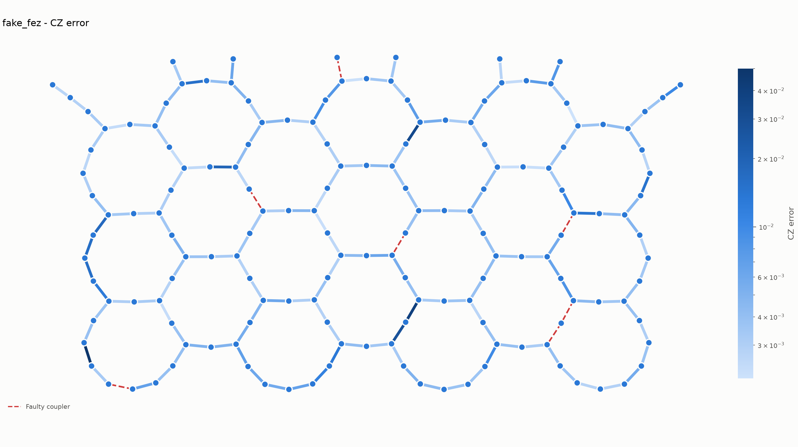
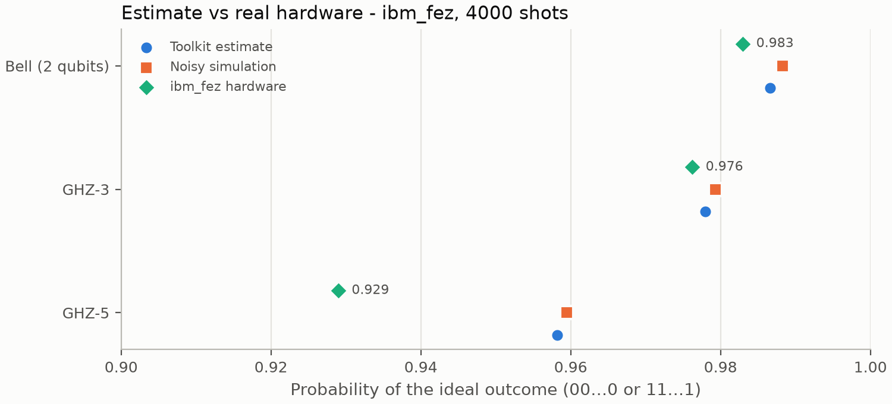
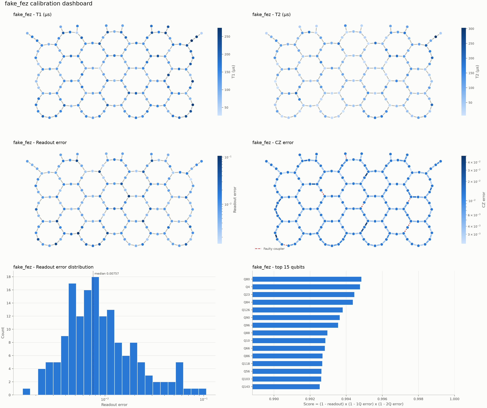

<div align="center">

# Quantum Noise Toolkit

**Characterize, simulate, analyse and visualize noise on real quantum hardware.**

[](https://github.com/shishir-kuet/quantum-noise-toolkit/actions/workflows/ci.yml)
[](https://www.python.org/)
[](https://www.ibm.com/quantum/qiskit)
[](LICENSE)
[](https://github.com/psf/black)



<sub>CZ gate errors across IBM's 156-qubit <code>ibm_fez</code>. Dashed red couplers are disabled on the device.</sub>

</div>

---

Today's quantum processors are noisy: every gate, measurement and idle nanosecond adds error,
and the error varies from qubit to qubit and from day to day. **Quantum Noise Toolkit** turns a
device's calibration data into answers to practical questions:

- *Which qubits and couplers are healthy right now, and which are broken?*
- *How likely is my circuit to succeed on this device, before I spend QPU time?*
- *Which device should I run it on?*
- *When hardware disagrees with the prediction, which qubit is responsible?*

It works with any Qiskit backend: live IBM Quantum devices, offline snapshots of them, or the
Aer simulator.

## Validated on real hardware

The toolkit's circuit-reliability estimate was tested against **IBM's 156-qubit `ibm_fez`**.



| Circuit | Toolkit estimate | Real hardware | Difference |
|---|---|---|---|
| Bell (2 qubits) | 0.987 | 0.983 | 0.4 pts |
| GHZ-3 | 0.978 | 0.976 | 0.2 pts |
| GHZ-5 | 0.958 | 0.929 | 2.9 pts |

For Bell and GHZ-3 the prediction is within 0.4 points, close to the shot-noise level of about
±0.2 points at 4000 shots. For GHZ-5 the toolkit's per-qubit
diagnosis traced most of the gap to **one qubit (Q140) that failed 3× more often than its
calibration predicted**, the signature of T1 drift. Idle decoherence accounted for only 0.3
points. Full analysis: [docs/hardware_validation.md](docs/hardware_validation.md).

## Features

| Module | What it does |
|---|---|
| **`characterization`** | T1, T2, frequencies, gate and readout errors and durations, per-qubit tables, backend summaries and comparison. Detects disabled qubits and couplers and keeps them out of averages |
| **`analysis`** | Circuit success probability before execution, with an error budget and optional idle-decoherence model; qubit ranking; robust (MAD) outlier detection; backend ranking and circuit–backend suitability |
| **`noise_models`** | Depolarizing, bit/phase flip, amplitude/phase damping, thermal relaxation, reset, readout and custom Kraus channels; channel composition; Aer noise models from channels or from device calibration |
| **`metrics`** | State, process and average gate fidelity, purity, trace distance, Hellinger fidelity, total variation distance |
| **`visualization`** | Device maps of T1, T2, readout and 2Q errors (Graphviz-free layout); dashboards, histograms, rankings; interactive Plotly maps |
| **`reports`** | Backend, circuit and noise reports in Markdown, HTML, JSON and CSV |
| **`cli`** | `qntoolkit summary / hotspots / analyze / report / dashboard` from the terminal |

## Installation

```bash
git clone https://github.com/shishir-kuet/quantum-noise-toolkit.git
cd quantum-noise-toolkit
python -m venv .venv
source .venv/bin/activate        # Windows: .venv\Scripts\activate
pip install -e ".[dev]"
```

Requires Python 3.11+. Everything works offline with Qiskit's fake backends. To use live IBM
Quantum devices, save your credentials once with `QiskitRuntimeService.save_account(...)` (see
[docs/installation.md](docs/installation.md)).

## Quick start

```python
from qiskit import QuantumCircuit
from qntoolkit import load_backend
from qntoolkit.analysis import analyse_circuit, error_hotspots
from qntoolkit.characterization import backend_summary
from qntoolkit.visualization import plot_cx_error_map

backend = load_backend("fake_fez")      # or "ibm_fez" for live calibration data

print(backend_summary(backend))
print(error_hotspots(backend).head())
plot_cx_error_map(backend, filename="cz_errors.png")

qc = QuantumCircuit(3, name="ghz")
qc.h(0)
qc.cx(0, 1)
qc.cx(1, 2)
qc.measure_all()

print(analyse_circuit(qc, backend, include_idle=True))
```

```
Backend               : fake_fez
Qubits (faulty)       : 156 (0)
Native 1Q / 2Q Gates  : sx / cz
Couplers (faulty)     : 176 (7)
Average T1            : 145.3 us
Average T2            : 90.5 us
Average 1Q Error      : 2.87e-04
Average 2Q Error      : 5.56e-03
Average Readout Error : 1.32e-02
...
Circuit              : ghz
Physical Qubits      : [0, 1, 2]
Two-Qubit Gate Count : 2
Estimated Fidelity   : 0.9831
Success Probability  : 0.9558
Circuit Reliability  : 95.6/100 (excellent)
```

### Command line

```bash
qntoolkit summary ibm_fez                    # calibration summary, best/worst qubits
qntoolkit hotspots ibm_fez                   # broken or drifting qubits and couplers
qntoolkit analyze circuit.qasm ibm_fez --idle
qntoolkit report ibm_fez -o fez_report.html
qntoolkit dashboard ibm_fez -o dashboard.png
```

### Noise channels and simulation

```python
from qntoolkit.metrics import gate_fidelity
from qntoolkit.noise_models import (
    AmplitudeDamping, DepolarizingNoise, NoiseModelBuilder, PhaseDamping, ReadoutNoise,
    noisy_simulator,
)

decay = AmplitudeDamping(0.05).compose(PhaseDamping(0.02))
print(gate_fidelity(decay))

model = (
    NoiseModelBuilder()
    .add(DepolarizingNoise(0.01, num_qubits=2), gates=["cx"])
    .add_readout(ReadoutNoise(0.02, 0.03))
    .build()
)
simulator = noisy_simulator(model)           # or noisy_simulator(backend) to mimic a device
```

## Examples and notebook

| | |
|---|---|
| [notebooks/quickstart.ipynb](notebooks/quickstart.ipynb) | Executed end-to-end walkthrough with figures |
| [examples/hardware_validation.py](examples/hardware_validation.py) | Runs Bell/GHZ on IBM hardware, compares with predictions, diagnoses each qubit |
| [examples/backend_analysis.py](examples/backend_analysis.py) | Calibration → analysis → figures → reports for any backend |
| [examples/ghz_state.py](examples/ghz_state.py) | How noise accumulates as GHZ states grow |
| [examples/bell_state.py](examples/bell_state.py) | Ideal vs noisy Bell state, depolarizing sweep |

<details>
<summary><b>Calibration dashboard</b> (click to expand)</summary>



</details>

## Architecture

```
            reports · cli
                 │
   visualization · analysis · metrics
                 │
   characterization · noise_models
                 │
               utils
                 │
   Qiskit · Qiskit Aer · Qiskit IBM Runtime
```

Every module reads hardware data from the backend's `Target`, so the same code runs on IBM
devices, fake backends and simulators. Units are explicit in every column name (`t1_us`,
`duration_ns`), and tables are pandas DataFrames. Design notes:
[docs/architecture.md](docs/architecture.md).

```
src/qntoolkit/
├── utils/              backend loading, exceptions
├── backend/            IBM backend information by name
├── characterization/   calibration extraction
├── noise_models/       noise channels, Aer noise models
├── metrics/            fidelities and distances
├── analysis/           circuit and backend analysis
├── visualization/      figures and interactive maps
├── reports/            Markdown / HTML / JSON / CSV reports
└── cli.py              command-line interface
```

## Quality

- **102 tests**: 85 run offline on fake backends and 17 run end-to-end against live IBM hardware
  (`pytest -m ibm`, skipped automatically without credentials)
- **93% line coverage** on the offline suite
- **CI** on every push and pull request: ruff, black and tests on Python 3.11, 3.12 and 3.13
- Physics checks in the tests, for example: amplitude damping sends \|1⟩ to \|0⟩; Kraus operators
  are trace-preserving; the closed-form idle error equals the thermal-relaxation channel's gate
  error; estimates equal the hand-computed product of calibrated errors

```bash
pytest -m "not ibm"       # offline
pytest                    # including live IBM Quantum tests
```

## Documentation

| | |
|---|---|
| [Installation](docs/installation.md) | Setup, IBM Quantum credentials, troubleshooting |
| [Tutorials](docs/tutorials.md) | Characterize, rank, estimate, simulate, visualize, report |
| [API reference](docs/api.md) | Every public function and class |
| [Theory](docs/theory.md) | T1/T2, noise channels, fidelity measures, the estimation model |
| [Hardware validation](docs/hardware_validation.md) | Predictions vs `ibm_fez` |
| [Architecture](docs/architecture.md) | Module layers and design decisions |

## Roadmap

All planned features for v0.2–v0.6 (characterization, noise models, circuit analysis,
visualization, reporting) are implemented. Next are a PyPI release, more notebooks and
algorithm examples (QAOA, VQE), validation on more devices, and calibration-drift tracking.
See [ROADMAP.md](ROADMAP.md).

> Quantum Noise Toolkit focuses on **understanding** noise, not correcting it. Its
> characterization and diagnostics are building blocks for error mitigation, error suppression
> and noise-aware compilation.

## Contributing

Contributions are welcome. See [CONTRIBUTING.md](CONTRIBUTING.md) for setup, code style and the
branch workflow (feature branches → `develop` → `main`), and [CODE_OF_CONDUCT.md](CODE_OF_CONDUCT.md).

## Citation

If you use this toolkit in research, please cite it via [CITATION.cff](CITATION.cff). GitHub
shows a *Cite this repository* button in the sidebar.

## License

MIT. See [LICENSE](LICENSE).

Built on [Qiskit](https://github.com/Qiskit/qiskit), [Qiskit Aer](https://github.com/Qiskit/qiskit-aer),
[Qiskit IBM Runtime](https://github.com/Qiskit/qiskit-ibm-runtime), NumPy, pandas, Matplotlib and Plotly.
